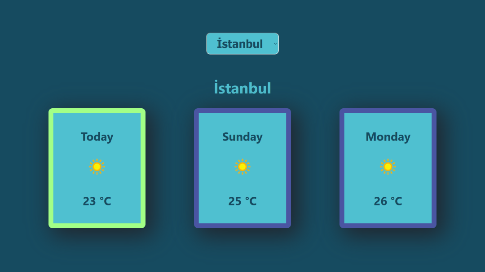

# Project Informations

---

# Features
This app has been created to provide users with weather condition datas. The datas include temperature degree as celcius with icons that refer to daily weather. The users can select the city and list the conditions for 3 days. In development process, principal goal was learning react and doing practice rather than design perfectly.

---

# Technologies - Libraries - APIs
The project is using `react.js` library / framework with context api structure. In addition, `weatherapi` was used to fetch weather informations.

---

# Install
1- Clone the repo to your local computer.
2- Locate to the project folder.
3- Use `npm i` command and then start the project with `npm start`.